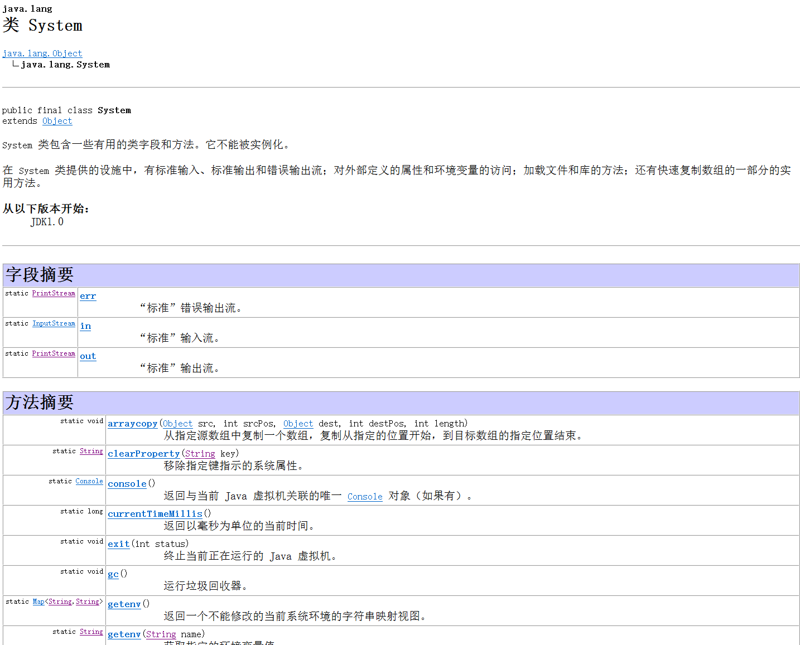
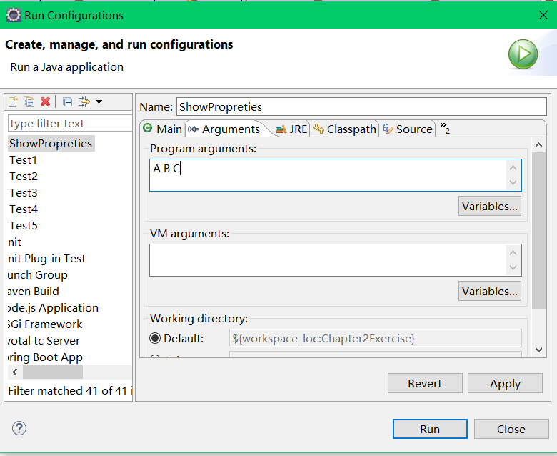

# 一切都是对象
# 目录
- **[必须由你创建所有对象](#必须由你创建所有对象)**
  - **[存储到什么地方](#存储到什么地方)**
    - **[特例基本类型](#特例基本类型)**
    - **[高精度数字](#高精度数字)**
    - **[java中的数组](#java中的数组)**
    - **[作用域](#作用域)**
    - **[对象的作用域](#对象的作用域)**
  - **[基本成员默认值](#基本成员默认值)**
  - **[方法参数和返回值](#方法参数和返回值)**
    - **[static关键字](#static关键字)**
  - **[system类](#system类)**
  - **[main函数中的args参数](#main函数中的args参数)**
  - **[javadoc](#javadoc)**

> 如果我们说另一种不同的语言，那么我们就会发觉一个有些不同的世界

## 必须由你创建所有对象

### 存储到什么地方

- 寄存器
  - 这是最快的存储区，因为它位于不同于其他存储区的地方，即处理器内部。但是寄存器的数量极其有限，所以寄存器根据需求进行分配。你不能直接控制，也不能在程序中感觉到寄存器存在的任何迹象（另一方面，C和C++允许您向编译器建议寄存器的分配方式）。
- 堆栈
  - 位于通用RAM（随机访问存储器）中，但通过堆栈指针可以从处理器那里获得直接支持。堆栈指针若向下移动，则分配新的内存；若向上移动，则释放那些内存。这是一种快速有效的分配存储方法，仅次于寄存器。创建程序时，Java系统必须知道存储在堆栈内所有项的确切生命周期，以便上下移动堆栈指针。这一约束限制了程序的灵活性，所以**某些**Java数据存储于堆栈中，特别是对象引用，但是Java**对象**并不存储于其中。
- 堆
  - 一种通用的内存池（也位于RAM区），用于存放**所有**Java对象。
  - 堆不同于堆栈的好处是：编译器不需要知道存储的数据在堆里存活多长时间。
  - 因此，在堆里分配存储有很大的灵活性。当需要一个对象时，只需要new写一行简单的代码，当执行这行代码时，会自动在堆里进行存储分配。
  - 当然，为这种灵活性必须要付出相应的代价：用堆进行存储分配和清理可能比用堆栈进行存储分配需要更多的时间。
- 常量存储
  - 常量值通常直接存放在程序代码内部，这样做是安全的，因为它们永远不会被改变。有时，在嵌入式系统中，常量本身会和其他部分隔离开，所以在这种情况下，可以选择将其存放在ROM（只读存储器）中。
  - ROM：这种存储区的一个例子是字符串池。所有字面常量字符串和具有字符串值得常量表达式都自动是内存限定的，并且会置于特殊的静态存储区中。
- 非RAM存储
  - 如果数据完全存活于程序之外，那么它可以不受程序的任何控制，在程序没有运行时也可以存在。其中两个基本的例子是**流对象**和**持久化对象**。
  - 在*流对象*中，对象转化成字节流，通常被发送给另一台机器。
  - 在*持久化对象*中，对象被存放于磁盘上，因此，即使程序终止，它们仍可以保持自己的状态。
  - 这种存储方式的技巧在于：把对象转化成可以存放在其他媒介上的事物，在需要时，可恢复成常规的、基于RAM的对象。
  - Java提供了对轻量级持久化的支持，而诸如JDBC和Hibernate这样的机制提供了更加复杂的对在数据库中存储和读取对象信息的支持。

#### 特例：基本类型

在程序设计中经常用到一系列类型，它们需要特殊对待。可以把它们想象成“基本”类型，之所以特殊对待，是因为`new`将对象存储在**堆**里，故用new创建一个对象，特别是小的、简单的变量，往往不是很有效。

因此，对于这些类型，Java采取与C和C++相同的方法。也就是说，不用new来创建变量、而是创建一个并非是引用的“自动”变量。这个变量直接存储**值**，并置于**堆栈**中，因此更加高效。

**Java要确定每种基本类型所占存储空间的大小。这种存储空间大小的不变性是Java程序比其他大多数语言编写的程序更具可移植性的原因之一。**

| 基本类型 | 大小   | 最小值    | 最大值           | 包装器类型 |
| :------: | ------ | --------- | ---------------- | ---------- |
| boolean  | -      | -         | -                | Boolean    |
|   char   | 16bit  | Unicode 0 | Unicode 2 ^16^-1 | Character  |
|   byte   | 8bits  | -128      | +127             | Byte       |
|  short   | 16bits | -2^15^    | +2^15^-1         | Short      |
|   int    | 32bits | -2^31^    | +2^31^-1         | Integer    |
|   long   | 64bits | -2^63^    | +2^63^-1         | Long       |
|  float   | 32bits | IEEE754   | IEEE754          | Float      |
|  double  | 64bits | IEEE754   | IEEE754          | Double     |
|   void   | -      | -         | -                | Void       |

- boolean类型所占存储空间的大小没有明确指定，仅定义为能够取字面值true或false
- 基本类型具有包装器类，使得可以在堆中创建一个非基本对象，用来表示对应的基本类型。

#### 高精度数字

Java提供了两个用于高精度计算的类：BigInteger和BigDecimal。虽然它们大体上属于“包装器类”的范畴，但二者都没有对应的基本类型。

能作用于int或float的操作，也同样能作用于BigInteger或BigDecimal。只不过必须以方法调用方式取代运算符方式来实现。这样做运算速度会比较慢，但是我们以时间换取了精度。

- BigInteger:支持任意精度的整数。也就是说，在运算中，可以精确地表示任何大小的整数值，而不会丢失任何信息。
- BigDecimal支持任何精度的定点数，例如，可以用它进行精确的货币计算。
- 具体使用可以查API。

#### Java中的数组

- 当创建一个数组**对象**时，实际上就是创建了一个引用数组，并且每个引用都会自动被初始化为一个特定值，该值拥有自己的关键字**null**。一旦Java看到null，就知道这个引用还没有**指向**某个对象，在使用任何引用前，**必须为其指定一个对象**；如果试图使用一个还是null的引用，在运行时将会报错。
- 还可以创建用来存放基本数据类型的数组。同样，编译器也能确保这种数组的初始化，因为它会将这种数组所占的内存全部置零。

#### 作用域

以下代码在C和C++中是合法的，但是在Java中却不能这样写：

```java
{
    int x = 12;
    {
        int x = 96;
    }
}
```

编译器将会报告 x 变量已经定义过。所以，在C和C++里将一个较大作用域的变量“隐藏”起来的做法，在Java里是不允许的。因为Java设计者认为这样做会导致程序混乱。

#### 对象的作用域

Java**对象**不具备和**基本类型**一样的生命周期。当用new创建一个Java对象时，它可以存活于作用域之外。

```java
{
    String s  = new String("a string");
}//End of scope
```

引用 s 在作用域终点就消失了。然而，s 指向的String对象**仍然继续占据内存空间**。在这一小段代码中，我们无法在这个作用域之后访问这个对象，因为对它唯一的引用已经超出了作用域的范围。

Java有一个垃圾回收器，用来监视用new创建的对象使用，并辨别那些不会被引用的对象。随后，释放这些对象的内存空间，以便供其他新的对象使用。

### 基本成员默认值

若类的某个成员是基本数据类型，即使没有进行初始化，Java也会确保它获得一个默认值。

当变量作为**类的成员**使用时，Java才确保给定其默认值，以确保那些是基本类型的成员变量得到初始化（C++没有此功能），防止产生程序错误。但是，这些初始值对你的程序来说，可能是不正确，甚至是不合法的。所以最好明确地对变量进行初始化。

| 基本类型 | 默认值         |
| :------: | -------------- |
| boolean  | false          |
|   char   | '\u0000'(null) |
|   byte   | (byte)0        |
|  short   | (short)0       |
|   int    | 0              |
|   long   | 0L             |
|  float   | 0.00f          |
|  double  | 0.00d          |

然而上述确保初始化的方法**并不适用于“局部”变量**（即非某个类的字段）。因此，如果**在某个方法定义**中有`int x`，那么变量 x 得到的可能是任意值（与C和C++中一样），而不会被自动初始化为零。所以在使用 x 前，应先对其赋一个适当的值。

### 方法、参数和返回值

**方法名和参数列表（它们合起来被称为“方法签名”）唯一地标识出某个方法。**

```java
int x = a.f();
```

返回值类型必须要与 x 的类型兼容。

这种调用方法的行为通常被称为**发送消息给对象**。在上面例子中，消息是f()，对象是 a。

**面向对象的程序设计通常简单地归纳为“向对象发送消息”。**

在参数列表中必须制定每个所传递对象的类型及名字。像Java中任何**传递对象**的场合一样，这里离传递的实际上也是引用。

- return关键字的用法
  - 它代表，“已经做完，离开此方法”
  - 如果此方法产生了一个值，这个值要放在return语句后面
  - 若返回类型是void，return关键字的作用只是用来退出方法。因此，没有必要到方法结束时才离开，可在任何地方返回。
- java中为什么包名小写
  - 包名同文件名，windows下大小写不敏感，UNIX下很敏感，有时在Windows下COPY东西会发现大小写会乱掉，故统一小写，保证Java跨平台。

#### static关键字

当创建类时，就是在描述那个类的对象的外观与行为。除非用new创建那个类的对象，否则，实际上并未获得对象。**执行new来创建对象时，数据存储空间才被分配，其方法才供外界调用。**

- static使用两种情形
  - 只想为某特定域分配单一存储空间，而不去考虑究竟要创建多少对象，甚至根本就不创建任何对象。
  - 希望某个方法不与包含它的类的任何对象关联在一起。也就是说，即使没有创建对象，也能够调用这个方法。

当声明一个事物是static时，就意味着这个域或方法不会与包含它的那个类的任何对象实例关联在一起。

有些面向对象语言采用**类数据**和**类方法**两个术语，代表那些数据和方法只是作为整个类，而不是类的特定对象而存在的。

```java
StaticTest.i++
```

使用类名是引用static变量的首先方式，这不仅是因为它强调了变量的static结构，而且在某些情况下它还为编译器进行**优化**提供了更好的机会。

**一个static字段对每个类来说都只有一份存储空间，而非static字段则是对每个对象都有一个存储空间。**

static方法的一个重要用法就是在不创建任何对象的前提下就可以调用它。这一点对定义main()方法很重要，这个方法是运行一个应用时的入口点。

### System类

System这个类中的所有字段和方法都是static，截取部分API图片。



### main函数中的args参数

```java
public static void main(String[] args){
    
}
```

写法是Java规定的，main方法参数必须为字符串数组，变量名可以随意，通常使用 args 即是arguments的缩写。

可以有同名的main方法函数，只要参数不同即可，即是方法重载。

**参数String[] args的作用就是可以在main方法运行前将参数传入main方法中**

- 在控制台中，输入编译执行命令时传入参数，即传入参数的使用为：java 类名 参数1 参数2 参数3 ...
- 在eclipse中使用String[] args
  - 鼠标右键点击程序，选择Run As-->Run Configyrations...
  - 在出现的窗口，选择Arguments栏，输入要输入的参数，空格隔开，最后点击run运行即可



### javadoc

javadoc只能为public和protected成员进行文档注释。private和包内可访问成员的注释会被忽略掉，所以输出结果看不到它们（不过可以用-private进行标记，以便把private成员的注释也包括在内）  

[练习题](https://github.com/wangwren/Java/tree/master/Chapter2Exercise/src)
