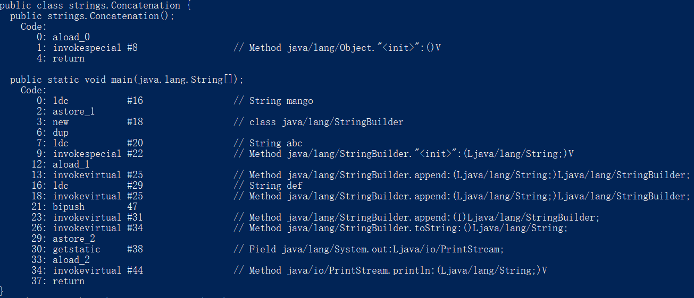
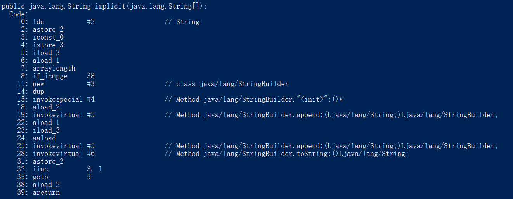
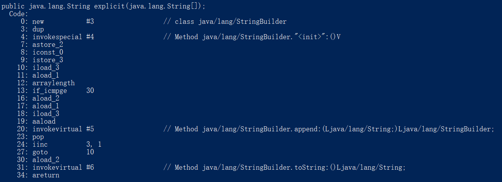

# 字符串

> 可以证明，字符串操作是计算机程序设计中最常见的行为

## 不可变String

String对象是不可变的。String类中每一个看起来会修改String值的方法，实际上都是创建了一个全新的 String 对象，以包含修改后的字符串内容。而最初的String对象则丝毫未动。

```java
package strings;

public class Immutable {

	public static String upcase(String s) {
		return s.toUpperCase();
	}
	public static void main(String[] args) {
		String q = "howdy";
		System.out.println(q); //howdy
		String qq = upcase(q);
		System.out.println(qq); //HOWDY
		System.out.println(q); 	//howdy
	}
}
/**
howdy
HOWDY
howdy
*/
```

当把 q 传给upcase()方法时，实际传递的是引用的一个拷贝。其实，每当把 String 对象作为方法的参数时，都会复制一份引用，而该引用所指的对象其实一直待在单一的物理位置上，从未动过。

回到 upcase() 定义，传入其中的引用有了名字 s，只有 upcase() 运行的时候，局部引用 s 才存在。一旦upcase()运行结束，s 就消失。当然了，upcase()的返回值，其实只是最终结果的引用。这足以说明，upcase()返回的引用指向了一个新的对象，而原本的 q 则还在原地。

String的这种行为方式其实正是我们想要的。例如：

```java
String s = "asdf";
String x = Immutable.upcase(s);
```

对于一个方法而言，参数是为该方法提供信息的，而不是想让该方法改变自己的。

## 重载“+”与StringBuilder

String对象是不可变的，可以给一个String对象加任意多的别名。因为String对象具有只读特性，所以指向它的任何引用都不可能改变它的值，因此，也就不会对其他的引用有什么影响。

不可变性会带来一定的效率问题。为String对象重载的“+”操作符就是一个例子。重载的意思是，一个操作符在应用于特定的类时，被赋予了特殊的意义（用于String的“+”与“+=”是Java中仅有的两个重载过的操作符，而Java并不允许程序员重载任何操作符）。

操作符“+”可以用来连接String：

```java
public class Concatenation{
    public static void main(String[] args){
        String mango = "mango";
        String s = "abc" + mango + "def" + 47;
        System.out.println(s);
    }
}
/**
abcmangodef47
*/
```

可以想象一下，这段代码可能是这样工作的：String可能有一个append()方法，它会生成一个新的String对象，以包含“abc”与mango连接后的字符串。然后，该对象再与“def”相连，生成另一个新的String对象，以此类推。

这种工作方式当然也行得通，但是为了生成最终的String，此方式会产生一大堆需要垃圾回收的中间对象。

想看以上代码到底是如何工作的，可以用JDK自带的 javap 来反编译以上代码。命令如下：

```java
javap -c Concatenation
```

这里的 -c 标志表示将生成JVM字节码。



其中的dup与invokevirtural语句相当于Java虚拟机上的会变语句。需要注意的重点是：编译器自动引入了java.lang.StringBuilder类。虽然我们在源码中并没有使用StringBuilder类，但是编译器却自作主张地使用了它，因为它更高效。

在这个例子中，编译器创建了一个StringBuilder对象，用以构造最终的String，并为每个字符串调用一次StringBuilder的append()方法，总计四次。最后调用toString()生成结果，并存为 s (使用的命令为astore_2)。

下面的程序采用两种方式生成一个String：方法一使用了多个String对象；方法二在代码中使用了StringBuilder。

```java
package strings;

public class WhiterStringBuilder {

	public String implicit(String[] fileds) {
		String result = "";
		for(int i = 0;i < fileds.length;i++) {
			result += fileds[i];
		}
		return result;
	}
	public String explicit(String[] fileds) {
		StringBuilder result = new StringBuilder();
		for(int i = 0;i < fileds.length;i++) {
			result.append(fileds[i]);
		}
		return result.toString();
	}
}
```

现在运行 javap -c WhiterStringBuilder，可以看到两个对应的字节码。首先是  implicit()方法：



注意从第8行到第35行构成了一个循环体。第8行：对堆栈中的操作数进行“大于或等于的整数比较运算”，循环结束时跳到38行。第35行：返回循环体的起始点（第5行）。要注意的重点是：StringBuilder是在循环之内构造的，这意味着每经过循环一次，就会创建一个新的StringBuilder对象。

下面是explicit()方法对应的字节码：



可以看到，不仅循环部分的代码更简短、更简单，而且它只生成了一个StringBuilder对象。显示地创建StringBuilder还允许你预先为其指定大小。如果你已经知道最终的字符串大概有多长，那预先指定StringBuilder的大小可以避免多次重新分配缓冲。

因此，当你为一个类编写toString()方法时，如果字符串操作比较简单，那就可以信赖编译器，它会为你合理地构造器最终的字符串结果。但是，如果你要在toString()方法中使用循环，那么最好自己创建一个StringBuilder对象，用它来构造最终的结果。

```java
package strings;

import java.util.Random;

public class UsingStingBuilder {

	public static Random rand = new Random(47);
	public String toString() {
		StringBuilder result = new StringBuilder("[");
		for(int i = 0;i < 25;i++) {
			result.append(rand.nextInt(100));
			result.append(", ");
		}
		result.delete(result.length() - 2, result.length());
		result.append("]");
		return result.toString();
	}
	public static void main(String[] args) {
		UsingStingBuilder usb = new UsingStingBuilder();
		System.out.println(usb);
	}
}
/**
[58, 55, 93, 61, 61, 29, 68, 0, 22, 7, 88, 28, 51, 89, 9, 78, 98, 61, 20, 58, 16, 40, 11, 22, 4]
*/
```

最终的结果是用append()语句一点点拼接其起来的。如果想走捷径，例如append(a + ":" + c),那编译器就会调入陷阱，从而为你另外创建一个StringBuilder对象处理括号内的字符串操作。

上面的例子中，使用delete()方法用它删除最后一个逗号与空格，以便添加右括号。

StringBuilder是Java SE5引入的，在这之前Java**用的是StringBuffer**。后者是线程安全的（参见21章，不知道能不能坚持到），因此开销也会大写。

## 无意识递归

